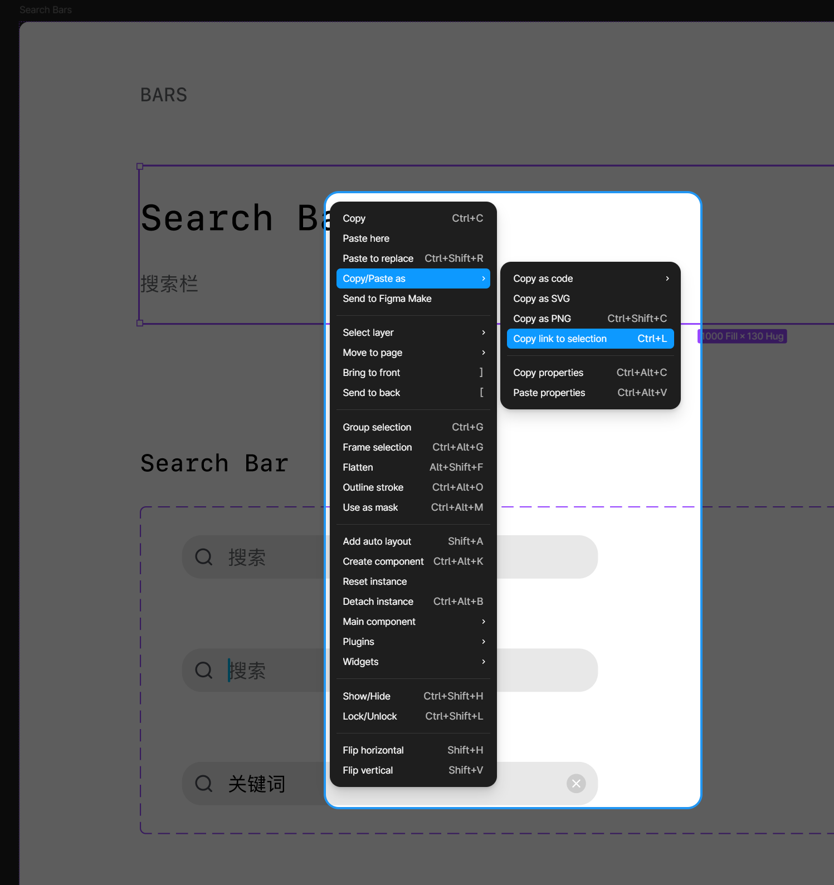

## **快速流程（5 步）**

```text
① 打开 Figma → 复制组件链接
② 把链接发给 IDE（Claude Code / Cursor）
③ AI 自动还原成 React 组件
④ 在 BuilderApp.tsx 注册组件
⑤ 打开 ?builder 拖拽搭页面
```


## **环境准备**

### **1. 安装 AI 技能包（Skills）**

本项目需要 2 个 Skill：**figma** 和 **figma-implement-design**。


**终极简单方法（推荐）**

把skill 文件夹整个复制到你的 AI IDE 技能目录，或者直接把包扔给AI让它安装就完事：

**Claude Code / Codex CLI：**

```bash
# Mac / Linux
cp -r .codex/skills/* ~/.codex/skills/

# Windows（PowerShell）
Copy-Item -Recurse .codex\skills\* $env:USERPROFILE\.codex\skills\
```

**Cursor / Windsurf：**

直接把 `.codex/skills/figma/` 和 `.codex/skills/figma-implement-design/` 两个文件夹拖进你 IDE 的 Skills 面板即可。

#### **手动安装**

如果你偏好手动操作：

**Mac / Linux：**

```Bash
mkdir -p ~/.codex/skills
cp -r .codex/skills/figma ~/.codex/skills/
cp -r .codex/skills/figma-implement-design ~/.codex/skills/
```

**Windows（PowerShell）：**

```PowerShell
New-Item -ItemType Directory -Path "$env:USERPROFILE\.codex\skills" -Force
Copy-Item -Recurse ".codex\skills\figma" "$env:USERPROFILE\.codex\skills\"
Copy-Item -Recurse ".codex\skills\figma-implement-design" "$env:USERPROFILE\.codex\skills\"
```

**Windows（CMD）：**

```bash
xcopy /E /I .codex\skills\figma %USERPROFILE%\.codex\skills\figma
xcopy /E /I .codex\skills\figma-implement-design %USERPROFILE%\.codex\skills\figma-implement-design
```

### **2. 配置 Figma MCP**

同样让复制粘贴即可

```Bash
# 添加 Figma MCP Server
codex mcp add figma --url https://mcp.figma.com/mcp

# 登录 Figma（会弹出浏览器授权）
codex mcp login figma
```

### **3. 启动项目**

不想手动启动的话，直接扔给AI让它安装即可

```Bash
npm install
npm run dev
# 打开 http://localhost:5173/?builder
```

## **组件还原&更新操作说明**

### **① 复制 Figma 链接**

选中组件 → 右键 → Copy link to selection



### **② 发给 IDE**

把链接粘贴到对话框，配合下方提示词使用

### **③ AI 还原组件**

AI 会通过 Figma MCP 读取设计信息，生成 React 组件代码

### **④ 注册到搭建器**

在 `src/pages/builder/BuilderApp.tsx` 中：

- 顶部 import 组件
- `config.components` 里添加配置
- `config.categories` 里归类

### **⑤ 拖拽搭页面**

访问 `http://localhost:5173/?builder`

## **提示词**

> 直接复制下面整段发给 Claude Code / Cursor / Windsurf，把 `FIGMA_LINK` 替换成你的链接

```tex
## 环境检查

请先检查以下环境是否就绪，缺什么装什么，已有的跳过：

1. **Figma MCP**：检查是否已配置 figma-dev-mode-mcp-server
   - 没有 → 运行 codex mcp add figma --url https://mcp.figma.com/mcp
   - 登录：codex mcp login figma
2. **Skills**：检查以下 skill 是否存在
   - figma（路径 .codex/skills/figma/SKILL.md）→ Figma MCP 集成规则
   - figma-implement-design（路径 .codex/skills/figma-implement-design/SKILL.md）→ 还原流程
   - 如果缺失，把项目里的 .codex/skills/ 复制到用户主目录 ~/.codex/skills/
3. **项目依赖**：node_modules 是否完整，没有则运行 npm install
4. **开发服务器**：localhost:5173 是否可访问，没有则运行 npm run dev

## 任务

把下面这个 Figma 组件还原成 React 代码，并注册到可视化搭建器中。
请遵循 figma-implement-design skill 的完整工作流。

Figma 链接：FIGMA_LINK（记得换成你的）

## 执行步骤

### Step 1：读取设计（遵循 figma skill 流程）

1. 从链接中提取 fileKey 和 nodeId
2. 运行 get_design_context 获取结构化设计数据（布局、颜色、字体、间距等）
3. 运行 get_screenshot 获取视觉参考截图
4. 如果响应太大被截断，先用 get_metadata 获取节点树，再逐个子节点调用 get_design_context
5. 如果节点有多个变体（variants），每个变体都要单独读取
6. 下载 MCP 返回的图片/SVG 资源，直接使用 localhost 源，不要用占位符

### Step 2：生成 React 组件

- 组件放在 `src/components/` 对应分类目录下（Bars/Button/Template/Table/Frames 等）
- 文件名用 PascalCase，如 `MyComponent.tsx`
- 必须 export named function（不用 default export）
- Props 用 interface 定义，带注释说明每个字段
- 样式用 Tailwind CSS
- 如果用到项目已有的图标，从 `../../icons` 导入
- 参考已有组件的代码风格：`src/components/Bars/NavigationBar.tsx`

**⚠️ 关键：标记可编辑内容**

分析 Figma 组件后，在 Props interface 中用注释标注哪些属性需要暴露给搭建器编辑。以下内容**必须**标记为可编辑：

- 所有**文本内容**（标题、副标题、按钮文字、占位文字等）
- 所有**变体/类型**切换（default/active/disabled 等状态）
- 所有**开关控制**（是否显示某个元素、是否激活等）
- 所有**图标插槽**（左侧图标、右侧图标等）
- 所有**数值内容**（百分比、数量、金额等）
- 所有**选项切换**（平台选择、尺寸选择、颜色主题等）

示例：

    export interface MyComponentProps {
      /** 标题文字 @editable text */
      title?: string;
      /** 变体类型 @editable select */
      variant?: "default" | "active" | "disabled";
      /** 是否显示图标 @editable toggle */
      showIcon?: boolean;
      /** 左侧图标 @editable icon */
      icon?: ReactNode;
      /** 数值 @editable number */
      value?: number;
    }

### Step 3：注册到搭建器

打开 `src/pages/builder/BuilderApp.tsx`，做三件事：

**3.1 顶部添加 import**

    import { MyComponent } from "../../components/分类/MyComponent";

**3.2 在 config.components 里添加配置**

把 Step 2 中标记了 `@editable` 的每个 prop 都暴露为 field，**一个都不能漏**：

    MyComponent: {
        label: "中文名称",
        fields: {
            // @editable text → 文本字段
            title: { type: "text", label: "标题" },
            // @editable select → 下拉选择
            variant: {
                type: "select",
                label: "变体",
                options: [
                    { label: "默认", value: "default" },
                    { label: "激活", value: "active" },
                    { label: "禁用", value: "disabled" },
                ],
            },
            // @editable toggle → 是/否开关
            showIcon: {
                type: "radio",
                label: "显示图标",
                options: [
                    { label: "是", value: true },
                    { label: "否", value: false },
                ],
            },
            // @editable icon → 图标选择器
            icon: ICON_FIELD("图标"),
            // @editable number → 数值
            value: { type: "number", label: "数值" },
        },
        defaultProps: {
            title: "默认标题",
            variant: "default",
            showIcon: true,
            icon: "none",
            value: 0,
        },
        render: ({ title, variant, showIcon, icon, value }) => (
            <MyComponent
                title={title}
                variant={variant}
                showIcon={showIcon}
                icon={renderIcon(icon)}
                value={value}
            />
        ),
    },

**3.3 在 config.categories 里归类**

把组件名添加到对应分类的 components 数组中：
- 导航类 → navigation
- 按钮类 → buttons
- 卡片类 → cards
- 内容类 → content
- 输入类 → input
- 布局类 → layout

### Step 4：验证

- 打开 http://localhost:5173/?builder
- 确认左侧面板能看到新组件（带缩略图）
- 拖入画布，检查渲染是否正确
- 点右边编辑属性，**逐个检查每个 field 都能正常修改并实时生效**

## 注意事项

- 一次只处理一个组件（或一组变体）
- 如果组件有变体，用 type/variant prop 切换，不要拆成多个组件
- field 的 label 必须是中文
- 如果组件需要外层 padding，在 render 里包一个 div：`<div style={{ padding: "0 15px" }}><MyComponent /></div>`
- 组件宽度按 375px 手机屏幕适配
- **每个可编辑的 prop 都必须在 fields 中暴露，不能遗漏**
```


## **组件分类参考（按类别分开喂）**

不要一整个组件库全丢给 AI，按原子设计理论**一层一层喂**，还原度更高

```Plain
原子 → 分子 → 组织 → 模板 → 页面 → 源文件
```

| 层级 | 英文 | 包含 | 喂法 |
| ---- | ---- | ---- | ---- |
|      |      |      |      |

| **原子** | Atoms | 颜色、文本、形状、样式 | 一次性喂完，作为全局 Token 基础 |

| **图标** | Icons | 所有 SVG 图标 | 从 Figma 全量导出 SVG 到 `src/icons/`，脚本自动注册 |

| **分子** | Molecules | 按钮、导航栏、标签栏、弹窗 | 每个组件单独喂 |

| **组织** | Organisms | 卡片组、入口组、列表组 | 每个组件单独喂，变体多的要拆开 |

| **模板** | Templates | 内容原型、列表原型、详情原型、模块组合 | 用搭建器拖拽组合，不需要单独喂 |

| **页面** | Pages | 高保真视觉、真实数据填充 | 搭建器出页面后导出 |

| **源文件** | Files | 最终交付的代码文件 | 搭建器一键导出 |

**注意**：变体多的组件（如导航栏有 3 种样式），每个样式单独一组喂，不要混在一起。

## **项目结构速查**

```Plain
src/
├── components/          ← 组件代码
│   ├── Bars/            ← 导航栏、标签栏、按钮栏
│   ├── Button/          ← 按钮
│   ├── Template/        ← 卡片、功能块
│   ├── Table/           ← 列表行、分组标题
│   ├── Frames/          ← 空状态、容器
│   └── ...
├── icons/               ← SVG 图标组件
├── pages/
│   └── builder/
│       ├── BuilderApp.tsx    ← 搭建器主文件（注册组件的地方）
│       ├── iconRegistry.ts   ← 图标注册表（自动生成）
│       └── IconPicker.tsx    ← 图标选择器
└── ...
```

## **导出与协作**

### **搭建器导出了什么？**

点击右上角 **发布** 按钮后，会同时做三件事：

1. **下载 JSON 文件** → `page-2026-03-15.json`（页面数据）
2. **复制到剪贴板** → 可直接粘贴给开发
3. **存到 localStorage** → 访问 `?preview` 即可预览

### **开发拿到 JSON 怎么用？**

```Plain
方式一：直接渲染（推荐）
  → 把 JSON 放进项目，用 Puck 的 <Render> 组件渲染
  → 参考 src/pages/builder/PreviewPage.tsx

方式二：作为页面配置
  → JSON 存到后端/CMS，前端请求后用 <Render> 渲染
  → 适合多页面、动态内容场景

方式三：导出静态 HTML
  → 访问 ?preview 打开预览页
  → 右键 → 保存网页 → 得到独立 HTML
```

### **协作流程**

```Plain
设计师                              开发
  │                                  │
  ├── Figma 画组件                    │
  │                                  │
  ├── 复制链接 → 喂给 AI              │
  │     ↓                            │
  ├── AI 还原成 React 组件             │
  │     ↓                            │
  ├── 注册到搭建器                     │
  │     ↓                            │
  ├── 拖拽搭页面                      │
  │     ↓                            │
  ├── 点发布 → 导出 JSON ─────────→  拿到 JSON
  │                                  │
  │                                  ├── 放进项目
  │                                  ├── <Render> 渲染
  │                                  └── 上线
```

### **文件怎么给？**

| 方式                | 适合场景                  |
| ------------------- | ------------------------- |
| 直接发 JSON 文件    | 小团队、快速迭代          |
| 放到共享文件夹/网盘 | 多页面、版本管理          |
| 接入 Git 仓库       | 组件代码 + 页面数据一起管 |
| 后端 API 存储       | 动态页面、CMS 场景        |
